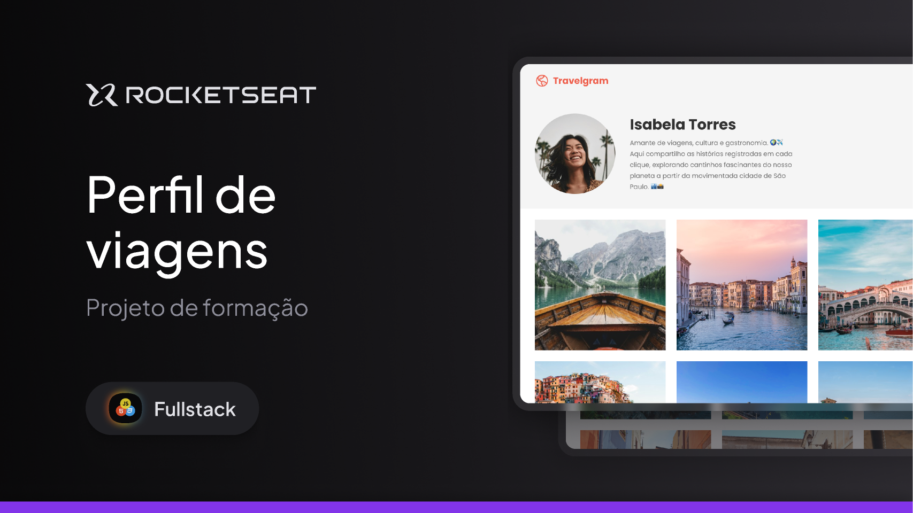

# Projeto Travelgram

Segundo Projeto da formação Fullstack da Rocketset. 
O objetivo do projeto e reproduzir um layout do Figma, utilizando todos os conceitos de HTML e CSS aprendidos até esse momento. 
O desenvolvimento foi feito seguindo o HTML semântico, flex box, estilização com classes, trabalho com imagnes, listas, textos e fontes.

## Executando
Após clonar o repositório, acesse a pasta do projeto e abra o arquivo `index.html` com o navegador de sua preferência.

[Figma](https://www.figma.com/community/file/1360315496868719817)